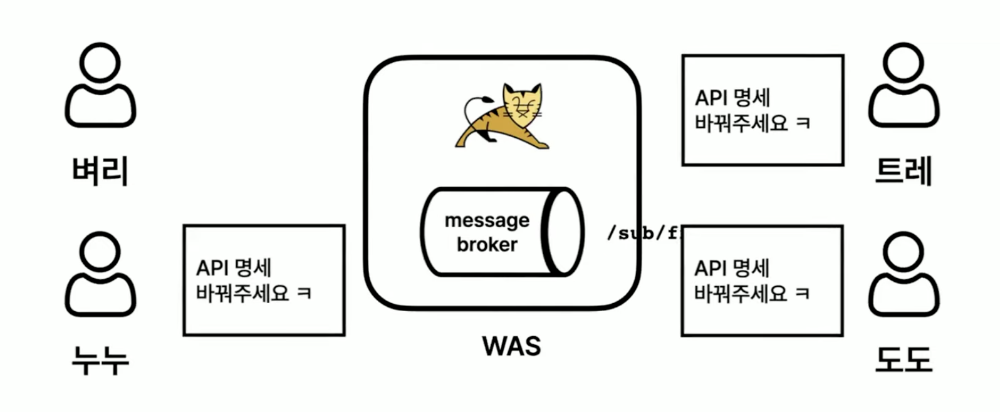
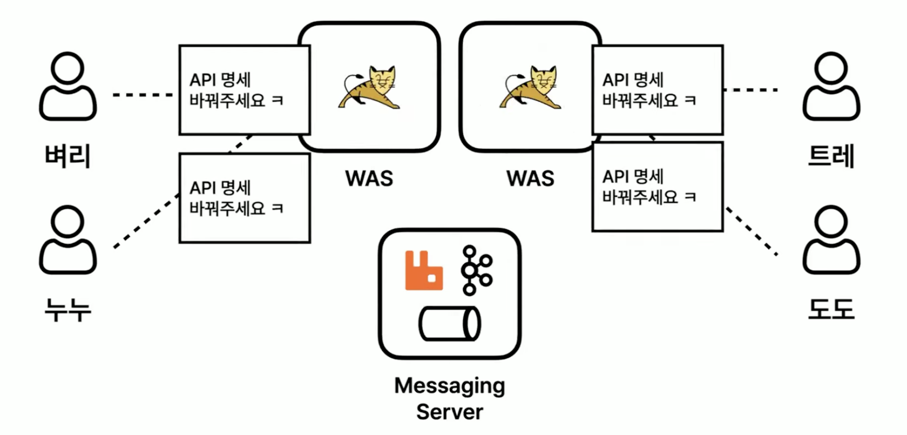

# Spring Chat Practice

Spring Boot, WebSocket, RabbitMQ를 활용한 **분산 실시간 채팅 애플리케이션** 연습 프로젝트입니다.

## 프로젝트 개요

두 사용자 간의 1:1 실시간 채팅을 구현한 학습용 프로젝트로, Spring Boot의 WebSocket과 STOMP 프로토콜을 활용하여 양방향 통신을 구현했습니다. **RabbitMQ를 추가하여 분산 시스템 환경에서도 메시지가 동기화되고 브로드캐스트되도록 개선**하였으며, Docker Compose를 통해 손쉽게 인프라를 구성할 수 있습니다.

### 주요 기능

- **실시간 1:1 채팅** - WebSocket을 통한 즉각적인 메시지 전달
- **분산 시스템 지원** - RabbitMQ를 통한 여러 서버 인스턴스 간 메시지 동기화 및 브로드캐스트
- **채팅방 생성 및 관리** - 중복 방지 로직 포함
- **과거 메시지 조회** - 페이징을 통한 효율적인 메시지 로드
- **내 채팅방 목록 조회**
- **채팅방 목록 UI**
- **Docker Compose 기반 인프라** - MySQL, RabbitMQ 자동 구성

## 기술 스택

### Backend
- **Java 17**
- **Spring Boot 3.5.7**
- **Spring Data JPA** - ORM 및 데이터 접근
- **Spring Web** - REST API
- **Spring WebSocket** - 실시간 양방향 통신
- **Spring AMQP (RabbitMQ)** - 분산 메시징 시스템
- **MySQL** - 데이터베이스
- **Lombok** - 코드 간소화

### Messaging & Infrastructure
- **RabbitMQ** - 분산 메시지 브로커 (STOMP 지원)
- **Docker Compose** - 컨테이너 오케스트레이션

### Frontend
- **Thymeleaf** - 서버 사이드 템플릿 엔진
- **SockJS 1.5.1** - WebSocket 폴백 지원
- **STOMP 2.3.4** - WebSocket 메시징 프로토콜

### Build Tool
- **Gradle**

## 시스템 아키텍처

### AS-IS


### TO-BE


### 분산 시스템 구조

```
┌────────────────────────────────────────────────────────────────────┐
│                      분산 채팅 시스템 아키텍처                        │
└────────────────────────────────────────────────────────────────────┘

   클라이언트 A        클라이언트 B        클라이언트 C
        │                  │                  │
        │ WebSocket        │ WebSocket        │ WebSocket
        ▼                  ▼                  ▼
   ┌─────────┐        ┌─────────┐        ┌─────────┐
   │ 서버 A   │        │ 서버 B   │        │ 서버 C   │
   │ :8080   │        │ :8081   │        │ :8082   │
   └────┬────┘        └────┬────┘        └────┬────┘
        │                  │                  │
        │    ┌─────────────┴─────────────┐    │
        │    │                           │    │
        ▼    ▼                           ▼    ▼
   ┌──────────────────────────────────────────────┐
   │             RabbitMQ Message Broker          │
   │          (STOMP Exchange: amq.topic)         │
   └──────────────────────┬───────────────────────┘
                          │
                          ▼
                     ┌─────────┐
                     │  MySQL  │
                     │(chatdb) │
                     └─────────┘

[메시지 흐름]
1. 클라이언트 → WebSocket → 서버 (ChatController)
2. 서버 → DB 저장 (ChatService)
3. 서버 → SimpMessagingTemplate ("/topic/chat.room.{roomId}"로 메시지 발행)
4. StompBrokerRelay → RabbitMQ (amq.topic exchange, routing key: "chat.room.{roomId}")
5. RabbitMQ → 해당 토픽을 구독 중인 모든 서버 인스턴스에게 메시지 분배
6. 각 서버 → WebSocket 브로드캐스트 (자신에게 연결된 클라이언트)
```

### 핵심 개념

| 구성요소 | 역할 | 설명 |
|---------|------|------|
| **WebSocket** | 클라이언트-서버 통신 | 실시간 양방향 메시지 전송 |
| **RabbitMQ** | 분산 메시지 브로커 | STOMP 프로토콜을 통해 메시지를 모든 서버 인스턴스에 브로드캐스트 |
| **STOMP Broker Relay** | 메시지 중계 | Spring 앱과 RabbitMQ 간 STOMP 메시지 중계 |
| **MySQL** | 데이터 영속화 | 메시지, 사용자, 채팅방 정보 저장 |

## ERD (Entity Relationship Diagram)

```
┌─────────────────┐
│      USER       │
├─────────────────┤
│ *id (PK)        │
│  name           │
└─────────────────┘
        │
        │ hosts
        │ (1)
        │
        ├──────────────────┐
        │                  │
        │                  │ guests
       (1)                (1)
        │                  │
┌───────▼──────────────────▼───┐
│        CHAT_ROOM             │
├──────────────────────────────┤
│ *id (PK)                     │
│ +hostId (FK → USER.id)       │
│ +guestId (FK → USER.id)      │
└──────────────────────────────┘
        │
        │ contains
        │ (1)
        │
       (*)
        │
┌───────▼──────────────────────┐
│       CHAT_MESSAGE           │
├──────────────────────────────┤
│ *id (PK)                     │
│ +roomId (FK → CHAT_ROOM.id)  │
│ +senderId (FK → USER.id)     │
│  message                     │
│  createdAt                   │
└──────────────────────────────┘
        │
        │ sends
       (*)
        │
       (1)
        │
    (back to USER)

관계 표기법:
  *  = Primary Key
  +  = Foreign Key
  1  = 정확히 1개
  *  = 0개 이상
  ?  = 0개 또는 1개
  │  = 관계선
```

### 엔티티 설명

#### User (사용자)
- 채팅 사용자 정보를 저장
- 채팅방의 호스트 또는 게스트가 될 수 있음

#### ChatRoom (채팅방)
- 두 사용자 간의 1:1 채팅방을 나타냄
- `hostId`: 채팅방 개설자
- `guestId`: 채팅 상대방
- 동일한 사용자 조합에 대해 중복 생성 방지

#### ChatMessage (채팅 메시지)
- 채팅방 내에서 주고받은 메시지
- 발신자 정보와 생성 시간 자동 기록
- 메시지는 생성 시간 역순으로 조회 가능

## API 명세

### REST API

#### 1. 채팅방 생성
```http
POST /api/v1/chat/rooms
```

**Query Parameters**
| 파라미터 | 타입 | 필수 | 설명 |
|---------|------|------|------|
| hostId | Long | O | 채팅방 개설자 ID |
| guestId | Long | O | 채팅 상대방 ID |

**Response**
```json
{
  "roomId": 1,
  "hostId": 1,
  "hostName": "user1",
  "guestId": 2,
  "guestName": "user2"
}
```

#### 2. 과거 메시지 조회
```http
GET /api/v1/chat/rooms/{roomId}/messages
```

**Path Parameters**
| 파라미터 | 타입 | 설명 |
|---------|------|------|
| roomId | Long | 채팅방 ID |

**Query Parameters**
| 파라미터 | 타입 | 필수 | 기본값 | 설명 |
|---------|------|------|-------|------|
| page | int | X | 0 | 페이지 번호 (0부터 시작) |
| size | int | X | 10 | 페이지당 메시지 수 |

**Response**
```json
[
  {
    "messageId": 1,
    "roomId": 1,
    "senderId": 1,
    "senderName": "user1",
    "message": "안녕하세요",
    "createdAt": "2025-11-13T10:30:00"
  }
]
```

#### 3. 내 채팅방 목록 조회
```http
GET /api/v1/chat/rooms/my
```

**Query Parameters**
| 파라미터 | 타입 | 필수 | 설명 |
|---------|------|------|------|
| userId | Long | O | 조회할 사용자 ID |

**Response**
```json
[
  {
    "roomId": 1,
    "hostId": 1,
    "hostName": "user1",
    "guestId": 2,
    "guestName": "user2"
  }
]
```

### WebSocket API

#### 연결 엔드포인트
```
ws://localhost:8080/ws-stomp
```

- SockJS 지원으로 WebSocket을 사용할 수 없는 환경에서도 동작

#### 메시지 전송 (STOMP)

**Subscribe (수신)**
```
/topic/chat.room.{roomId}
```
- 특정 채팅방의 메시지를 실시간으로 수신
- ⚠️ **중요:** RabbitMQ STOMP는 routing key에 슬래시(`/`) 대신 점(`.`)을 사용해야 합니다

**Send (송신)**
```
/app/chat/message
```

**Payload**
```json
{
  "roomId": 1,
  "senderId": 1,
  "message": "안녕하세요"
}
```

**Broadcast Response**
```json
{
  "messageId": 1,
  "roomId": 1,
  "senderId": 1,
  "senderName": "user1",
  "message": "안녕하세요",
  "createdAt": "2025-11-13T10:30:00"
}
```

### View Pages

#### 채팅방 목록
```http
GET /chat-rooms
```
- 전체 채팅방 목록을 보여주는 페이지

#### 채팅 페이지
```http
GET /chat-room/{roomId}?sender={userId}
```

**Path Parameters**
| 파라미터 | 타입 | 설명 |
|---------|------|------|
| roomId | Long | 채팅방 ID |

**Query Parameters**
| 파라미터 | 타입 | 필수 | 설명 |
|---------|------|------|------|
| sender | Long | O | 현재 사용자 ID |

## 프로젝트 구조

```
/Users/hw/chat/
├── docker-compose.yml                    # 인프라 구성 (MySQL, RabbitMQ)
├── build.gradle                          # Gradle 의존성 설정
├── src/main/
│   ├── java/com/example/chat/
│   │   ├── ChatApplication.java          # 메인 애플리케이션
│   │   ├── controller/
│   │   │   ├── ChatController.java       # WebSocket 메시지 처리
│   │   │   ├── ChatRoomController.java   # 채팅방 REST API
│   │   │   └── ChatViewController.java   # 뷰 컨트롤러
│   │   ├── domain/                       # JPA 엔티티
│   │   │   ├── ChatMessage.java
│   │   │   ├── ChatRoom.java
│   │   │   └── User.java
│   │   ├── dto/                          # Data Transfer Objects
│   │   │   ├── ChatMessageDto.java
│   │   │   └── ChatRoomDto.java
│   │   ├── service/                      # 비즈니스 로직
│   │   │   ├── ChatService.java
│   │   │   ├── ChatRoomService.java
│   │   │   └── UserService.java
│   │   ├── repository/                   # 데이터 접근 계층
│   │   │   ├── ChatMessageRepository.java
│   │   │   ├── ChatRoomRepository.java
│   │   │   └── UserRepository.java
│   │   └── config/                       # 설정
│   │       ├── WebSocketConfig.java      # WebSocket 설정 (RabbitMQ STOMP Broker Relay)
│   │       └── DataInitializer.java      # 초기 데이터 생성
│   └── resources/
│       ├── application.yaml              # 애플리케이션 설정 (DB, RabbitMQ)
│       ├── static/                       # 정적 파일
│       └── templates/                    # Thymeleaf 템플릿
│           ├── rooms.html                # 채팅방 목록 페이지
│           └── chat.html                 # 채팅 페이지
└── README.md
```

## 설치 및 실행

### ⚠️ 중요 유의사항

#### RabbitMQ STOMP 플러그인 필수

이 프로젝트는 **RabbitMQ STOMP 플러그인**을 사용합니다. RabbitMQ는 기본적으로 STOMP 프로토콜을 지원하지 않으므로, 반드시 플러그인을 활성화해야 합니다.

**현재 설정:**
- `docker-compose.yml`에 자동 활성화 설정이 포함되어 있습니다
- 컨테이너 최초 실행 시 자동으로 플러그인이 활성화됩니다

**만약 애플리케이션이 시작되지 않는다면:**
1. RabbitMQ STOMP 플러그인 활성화 상태 확인
2. [트러블슈팅](#트러블슈팅) 섹션의 "애플리케이션 시작 실패 - STOMP 연결 오류" 참고

#### RabbitMQ STOMP Destination 형식

RabbitMQ STOMP를 사용할 때는 **destination 경로에 슬래시(`/`) 대신 점(`.`)을 사용**해야 합니다.

**올바른 형식:**
```javascript
// ✅ 올바름 - 점(.) 사용
stompClient.subscribe('/topic/chat.room.1', callback);
template.convertAndSend("/topic/chat.room." + roomId, message);
```

**잘못된 형식:**
```javascript
// ❌ 잘못됨 - 슬래시(/) 사용
stompClient.subscribe('/topic/chat/room/1', callback);
template.convertAndSend("/topic/chat/room/" + roomId, message);
```

**이유:**
- RabbitMQ STOMP는 `/topic/` prefix를 제거한 후 나머지 부분을 routing key로 사용
- `chat/room/1`은 유효하지 않은 routing key
- `chat.room.1`은 유효한 routing key (AMQP 표준)
- 자세한 내용은 [트러블슈팅](#트러블슈팅) 섹션 참고

#### 분산 시스템 구조

- 이 프로젝트는 **여러 서버 인스턴스**가 동시에 실행되는 분산 환경을 지원합니다
- RabbitMQ의 **STOMP Broker Relay**를 통해 모든 서버가 메시지를 공유합니다
- Kafka와 달리 Consumer Group 개념이 없으며, 모든 서버가 메시지를 수신합니다

### 사전 요구사항

- **Java 17** 이상
- **Docker** 및 **Docker Compose**
- **Gradle 7.x** 이상

### 방법 1: Docker Compose로 전체 환경 시작 (권장)

#### 1. Docker 인프라 시작
```bash
# MySQL, RabbitMQ 컨테이너 시작
docker-compose up -d
```

**구성 서비스:**
- MySQL (포트: 3306)
  - Database: `chatdb`
  - Username: `root`
  - Password: `root1234`
- RabbitMQ (포트: 5672 - AMQP, 15672 - Management UI, 61613 - STOMP)
  - Management UI: `http://localhost:15672` (기본 계정: guest / guest)

#### 2. 컨테이너 상태 확인
```bash
# 모든 서비스가 정상 실행 중인지 확인
docker-compose ps
```

출력 예시:
```
NAME                IMAGE                              STATUS
mysql-db            mysql:8.0                          Up
rabbitmq            rabbitmq:3-management              Up
```

#### 2.1. RabbitMQ STOMP 플러그인 확인 (중요)

**RabbitMQ는 기본적으로 STOMP 프로토콜을 지원하지 않습니다.**
반드시 `rabbitmq_stomp` 플러그인이 활성화되어 있어야 합니다.

**자동 활성화 (권장)**
- 현재 `docker-compose.yml`에 자동 활성화 설정이 포함되어 있습니다
- 컨테이너 시작 시 자동으로 플러그인이 활성화됩니다

**수동 확인 방법**
```bash
# STOMP 플러그인 상태 확인
docker exec rabbitmq rabbitmq-plugins list | grep stomp

# 출력 예시 ([E*]가 표시되어야 함)
# [E*] rabbitmq_stomp                    3.13.7
```

**수동 활성화 (필요시)**
```bash
# STOMP 플러그인 활성화
docker exec rabbitmq rabbitmq-plugins enable rabbitmq_stomp

# RabbitMQ 재시작
docker-compose restart rabbitmq
```

#### 3. 애플리케이션 빌드
```bash
./gradlew build
```

#### 4. 애플리케이션 실행
```bash
# 단일 인스턴스 실행
./gradlew bootRun
```

또는

```bash
# JAR 파일로 실행
java -jar build/libs/chat-0.0.1-SNAPSHOT.jar
```

#### 5. 브라우저에서 접속
```
http://localhost:8080
```

#### 6. 종료
```bash
# 애플리케이션 종료: Ctrl + C

# Docker 컨테이너 종료 및 제거
docker-compose down

# 데이터 볼륨까지 삭제 (데이터베이스 초기화)
docker-compose down -v
```

### 방법 2: 분산 환경 테스트 (여러 서버 인스턴스 실행)

여러 서버 인스턴스를 실행하여 RabbitMQ를 통한 메시지 동기화를 테스트할 수 있습니다.

#### 1. Docker 인프라 시작 (위와 동일)
```bash
docker-compose up -d
```

#### 2. 애플리케이션 빌드
```bash
./gradlew build
```

#### 3. 여러 포트로 서버 인스턴스 시작

**터미널 1 - 서버 A (8080)**
```bash
java -jar build/libs/chat-0.0.1-SNAPSHOT.jar --server.port=8080
```

**터미널 2 - 서버 B (8081)**
```bash
java -jar build/libs/chat-0.0.1-SNAPSHOT.jar --server.port=8081
```

**터미널 3 - 서버 C (8082)**
```bash
java -jar build/libs/chat-0.0.1-SNAPSHOT.jar --server.port=8082
```

#### 4. 분산 시스템 동작 확인

1. 브라우저 A에서 `http://localhost:8080` 접속
2. 브라우저 B에서 `http://localhost:8081` 접속
3. 브라우저 C에서 `http://localhost:8082` 접속
4. 같은 채팅방에 입장 후 메시지 전송
5. **모든 브라우저에서 메시지가 실시간으로 수신됨** ✅

**동작 원리:**
- 브라우저 A가 서버 8080으로 메시지 전송
- 서버 8080이 SimpMessagingTemplate을 통해 RabbitMQ로 메시지 발행
- RabbitMQ가 해당 토픽을 구독 중인 모든 서버(8080, 8081, 8082)에게 메시지 분배
- 각 서버는 자신에게 연결된 WebSocket 클라이언트들에게 브로드캐스트
- 결과: 모든 클라이언트가 메시지 수신 (중복 없음)

### 초기 데이터

애플리케이션 시작 시 `DataInitializer`가 자동으로 다음을 생성합니다:
- 테스트 사용자 3명 (user1, user2, user3)
- 테스트 채팅방 2개
- 샘플 메시지

## 주요 기능 흐름

### 1. 분산 환경 실시간 메시지 전송 (RabbitMQ 포함)
```
클라이언트 A (WebSocket)
  → /app/chat/message (STOMP Send)
  → ChatController.sendMessage()
  → ChatService.processAndSaveMessage()
      - DB에 메시지 저장 (messageId, createdAt 자동생성)
      - UserService로 발신자 이름 조회
      - 완성된 ChatMessageDto 반환
  → SimpMessagingTemplate.convertAndSend("/topic/chat.room.{roomId}", message)
      - WebSocketConfig에 설정된 StompBrokerRelay를 통해 RabbitMQ로 메시지 중계
      - destination: /topic/chat.room.{roomId}
      - routing key: chat.room.{roomId} (점(.) 구분자 사용)
  → RabbitMQ Broker (amq.topic exchange)
      - routing key 기반으로 메시지 라우팅
      - 메시지를 해당 토픽을 구독 중인 모든 서버 인스턴스에게 분배
  → 각 서버의 StompBrokerRelay
  → WebSocket으로 연결된 클라이언트들에게 브로드캐스트
  → 클라이언트가 /topic/chat.room.{roomId}를 구독 중이면 메시지 수신
```

### 2. 채팅방 생성
```
클라이언트
  → POST /api/v1/chat/rooms?hostId=1&guestId=2
  → ChatRoomController.creatRoom()
  → ChatRoomService.createRoom()
      - 중복 체크 (findByTwoUsers)
      - 양방향 검색 (hostId/guestId 순서 무관)
      - 새 채팅방 생성 또는 기존 채팅방 반환
```

### 3. 과거 메시지 조회
```
클라이언트
  → GET /api/v1/chat/rooms/{roomId}/messages?page=0&size=10
  → ChatRoomController.getMessages()
  → ChatRoomService.getMessages()
      - 페이징된 메시지 조회 (최신순)
      - 각 메시지의 발신자 이름 매핑
```

## 설계 특징

### 1. 분산 시스템 지원 (RabbitMQ 기반)
- **수평 확장 가능**: 서버 인스턴스를 여러 개 추가해도 메시지 중복 수신 없이 모든 클라이언트에게 전달
- **STOMP Broker Relay**: Spring이 RabbitMQ와 STOMP 프로토콜로 통신하여 메시지 브로드캐스트
- **메시지 라우팅**: RabbitMQ의 Exchange를 통해 유연하고 효율적인 메시지 라우팅
- **낮은 지연 시간**: 실시간 채팅에 적합한 빠른 메시지 전달

### 2. 양방향 채팅방 지원
- `ChatRoomRepository.findByTwoUsers()` 메서드가 hostId/guestId 순서와 관계없이 동일한 채팅방을 반환
- 중복 채팅방 생성 방지

### 3. DTO 패턴 활용
- 엔티티와 별도로 DTO를 사용하여 클라이언트에 필요한 정보 전달
- 엔티티에 없는 필드(senderName, hostName, guestName) 추가 가능

### 4. 페이징 지원
- Spring Data JPA의 `Pageable`을 활용한 효율적인 메시지 조회
- 과거 메시지를 필요한 만큼만 로드

### 5. 자동 타임스탬프
- `@CreationTimestamp`를 사용하여 메시지 생성 시간 자동 기록

### 6. WebSocket 폴백
- SockJS를 통해 WebSocket을 지원하지 않는 환경에서도 동작 가능

### 7. Docker Compose 기반 인프라
- 한 번의 명령으로 MySQL, RabbitMQ 환경 구성
- 개발 환경 표준화 및 빠른 시작 가능

## 학습 포인트

이 프로젝트를 통해 다음을 학습할 수 있습니다:

### 실시간 통신
- Spring Boot와 WebSocket을 활용한 실시간 통신 구현
- STOMP 프로토콜을 이용한 메시지 브로커 패턴

### 분산 시스템
- **RabbitMQ를 활용한 분산 메시징 아키텍처**
- **STOMP Broker Relay를 통한 WebSocket 메시지 브로드캐스트**
- **수평 확장 가능한 시스템 설계**
- **RabbitMQ STOMP 프로토콜의 특성과 제약사항**
  - Routing key 형식 (점(.) 구분자 사용, 슬래시 불가)
  - AMQP Exchange 모델과 STOMP 통합
  - Topic exchange 기반 pub/sub 패턴

### 데이터 관리
- Spring Data JPA를 활용한 효율적인 데이터 접근
- 엔티티와 DTO를 분리한 계층화 아키텍처
- 페이징을 통한 대용량 데이터 처리

### 인프라 및 DevOps
- Docker Compose를 통한 컨테이너 오케스트레이션
- 로컬 개발 환경 표준화
- 멀티 인스턴스 배포 전략

### API 설계
- REST API와 WebSocket API의 조합
- 명확한 책임 분리 (Controller, Service, Repository)

## 트러블슈팅

### ⚠️ 애플리케이션 시작 실패 - STOMP 연결 오류

**증상:**
```
ERROR o.s.m.s.s.StompBrokerRelayMessageHandler : TCP connection failure in session _system_
APPLICATION FAILED TO START
```

**원인:** RabbitMQ STOMP 플러그인이 활성화되지 않음

**해결 방법:**
```bash
# 1. STOMP 플러그인 상태 확인
docker exec rabbitmq rabbitmq-plugins list | grep stomp

# 2. 플러그인이 비활성화되어 있다면 ([E*]가 없으면)
docker exec rabbitmq rabbitmq-plugins enable rabbitmq_stomp

# 3. RabbitMQ 재시작
docker-compose restart rabbitmq

# 4. 플러그인 활성화 확인 ([E*] 표시 확인)
docker exec rabbitmq rabbitmq-plugins list | grep stomp

# 5. 애플리케이션 재시작
./gradlew bootRun
```

**예방:**
- `docker-compose.yml`에 자동 활성화 설정이 포함되어 있으므로, 컨테이너를 완전히 재생성하면 자동으로 활성화됩니다
```bash
docker-compose down
docker-compose up -d
```

### ⚠️ WebSocket 연결 후 메시지 전송 시 "Invalid destination" 오류

**증상:**
브라우저 콘솔에 다음과 같은 에러 표시:
```
<<< ERROR
message:Invalid destination
content-type:text/plain
'/chat/room/1' is not a valid topic destination
```

RabbitMQ 로그:
```
[error] STOMP error frame sent:
[error] Message: "Invalid destination"
[error] Detail: "'/chat/room/1' is not a valid topic destination"
```

**원인:**
RabbitMQ STOMP는 routing key에 슬래시(`/`)를 허용하지 않습니다. `/topic/chat/room/1` 형식을 사용하면 RabbitMQ가 prefix(`/topic/`)를 제거한 후 `chat/room/1`을 routing key로 사용하려 하는데, 슬래시가 포함되어 있어서 거부합니다.

**해결 방법:**

1. **Backend 수정 (ChatController.java)**
```java
// ❌ 잘못된 코드
template.convertAndSend("/topic/chat/room/" + roomId, message);

// ✅ 올바른 코드
template.convertAndSend("/topic/chat.room." + roomId, message);
```

2. **Frontend 수정 (chat.html)**
```javascript
// ❌ 잘못된 코드
stompClient.subscribe('/topic/chat/room/' + roomId, callback);

// ✅ 올바른 코드
stompClient.subscribe('/topic/chat.room.' + roomId, callback);
```

3. **애플리케이션 재시작**
```bash
./gradlew bootRun
```

4. **브라우저 완전 새로고침** (Cmd+Shift+R 또는 Ctrl+Shift+R)

**기술적 배경:**
- RabbitMQ STOMP에서 `/topic/xxx` destination은 `amq.topic` exchange를 사용
- `/topic/` prefix가 제거되고 나머지 부분이 routing key로 사용됨
- AMQP 표준에서 routing key는 점(`.`)으로 구분되는 단어들의 시퀀스
- 슬래시(`/`)는 유효하지 않은 routing key 구분자
- 예: `chat.room.1` (유효), `chat/room/1` (무효)

**확인 방법:**
```bash
# RabbitMQ 로그에서 에러 확인
docker logs rabbitmq --tail 50 | grep -i "invalid destination"

# 에러가 없으면 정상 작동 중
```

### RabbitMQ 연결 실패
```bash
# RabbitMQ 컨테이너 로그 확인
docker-compose logs rabbitmq

# RabbitMQ 재시작
docker-compose restart rabbitmq

# RabbitMQ Management UI 접속 (http://localhost:15672)하여 상태 확인
# 기본 계정: guest / guest
```

**확인 사항:**
- RabbitMQ 컨테이너가 실행 중인지: `docker-compose ps`
- STOMP 포트(61613)가 열려있는지: `netstat -an | grep 61613`
- 로그에서 STOMP 플러그인 시작 메시지 확인: `docker logs rabbitmq 2>&1 | grep stomp`

### MySQL 연결 실패
```bash
# MySQL 컨테이너 로그 확인
docker-compose logs mysql

# MySQL 접속 테스트
docker exec -it mysql-db mysql -u root -proot1234
```

### 포트 충돌
```bash
# 사용 중인 포트 확인 (Mac/Linux)
lsof -i :8080
lsof -i :5672
lsof -i :61613
lsof -i :15672
lsof -i :3306

# 사용 중인 포트 확인 (Windows)
netstat -ano | findstr :8080
```

## 향후 개선 사항

- [ ] 메시지 전송 실패 시 재시도 로직 (Dead Letter Queue)
- [ ] 사용자 인증/인가 (Spring Security + JWT)
- [ ] 그룹 채팅 기능 추가
- [ ] 파일 첨부 기능
- [ ] 읽음 표시 기능
- [ ] Kubernetes 배포 설정
- [ ] 모니터링 및 로깅 (Prometheus, Grafana, ELK Stack)

## 라이선스

이 프로젝트는 학습 목적으로 제작되었습니다.
